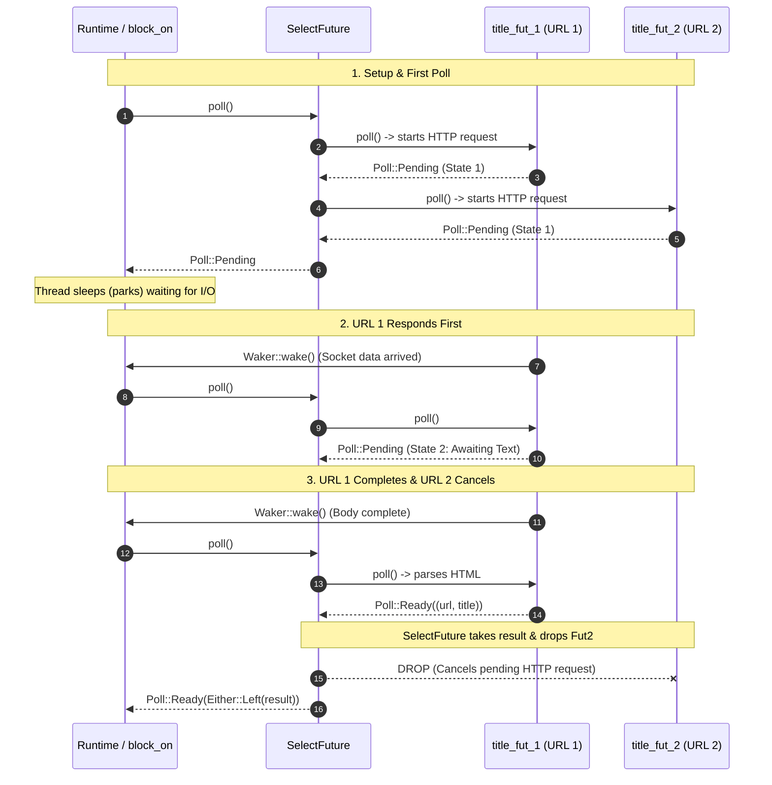
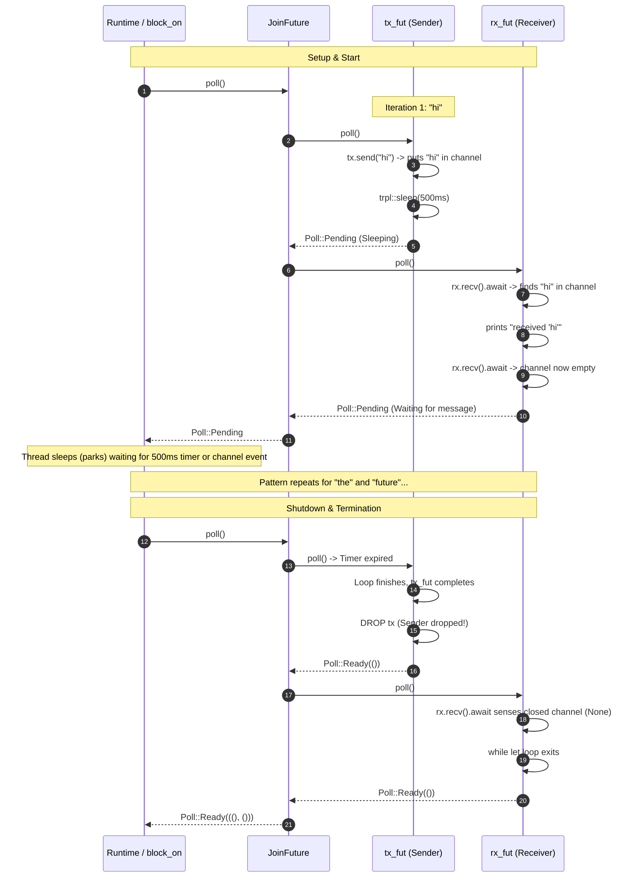

+++
date = "2026-09-11"
title = "Async Rust"
+++

#### Async Web Scrapper



Ref: https://rust-book.cs.brown.edu/ch17-02-concurrency-with-async.html

#### Async Message Passing



Ref: https://rust-book.cs.brown.edu/ch17-02-concurrency-with-async.html#listing-17-11

#### Self-Referential Types & Pin

Why `async` creates pointers pointing to itself:

```rust
async {
    let mut x = String::from("Hello");
    let ptr = &x; // A reference pointing to `x` inside the SAME struct!
    tokio::time::sleep(...).await;
    println!("{ptr}");
}
```

```
┌──────────────────────────────────────┐
│ Async Struct Memory Address: 0x1000  │
├──────────────────────────────────────┤
│ x: "Hello"                           │
│ ptr: 0x1000  ───(points to x)──────► │
└──────────────────────────────────────┘
```

When the struct gets moved: return this future from a function, push it into a Vec, or move it to another stack frame

Pin guarantees that the value's memory address will not change, making it safe to dereference internal self-references during `.poll()`.

#### State Machine

* generated per future
* state transition within `poll`
* returns `Ready(output)` when it reaches to final state
* it will continuously advance its state it until hits a nested future that returns `Poll::Pending` or reaches the end

#### Polling a Future by Reference Using Stack Pinning Scenarios

* Stream Processing with Backpressure / Cancellation
* Hedging Requests (e.g. cache request races DB request)

#### How the Registration works in code conceptually

```rust
fn poll(mut self: Pin<&mut Self>, cx: &mut Context<'_>) -> Poll<Self::Output> {
    if self.is_ready() {
        Poll::Ready(self.get_data())
    } else {
        // 1. Get a handle to the current waker
        let waker = cx.waker().clone();

        // 2. Register it with the background system (e.g., OS socket or timer)
        // E.g. mio register?
        self.background_system.register_waker(waker);

        // 3. Yield back to the executor
        Poll::Pending
    }
}
```
